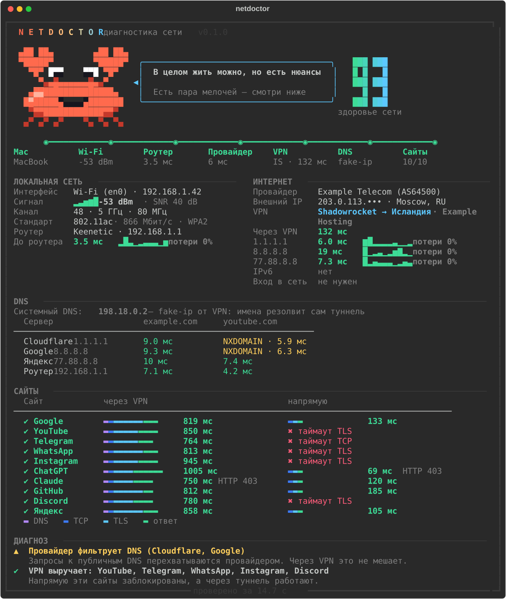
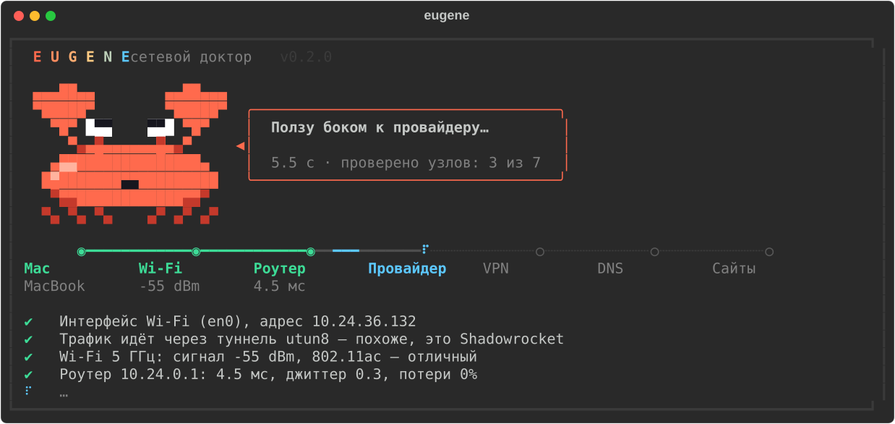
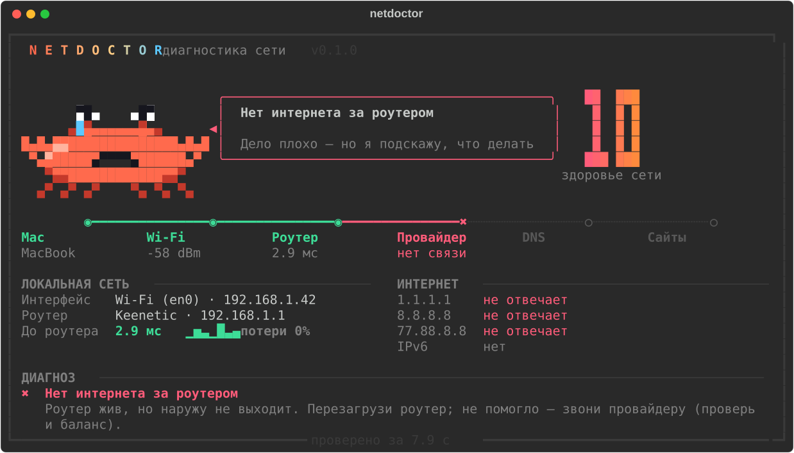

# 🦀 Eugene

**Юджин — краб, который выясняет, почему не работает интернет.**

> «Юджин, что с интернетом?» — и через 15 секунд у вас готовый диагноз.

Одна команда — и Юджин по цепочке проверяет весь путь от вашего Mac до любимых сайтов:
Wi-Fi → роутер → провайдер → VPN → DNS → сайты. А потом объясняет человеческим языком,
где именно сломалось и что с этим делать.



## Что умеет

- **Wi-Fi** — уровень сигнала, шум и SNR, диапазон, канал, стандарт, скорость соединения.
- **Роутер** — задержка, джиттер, потери пакетов; узнаёт производителя (Keenetic, MikroTik, ASUS, TP-Link…).
- **Провайдер** — пинг до Cloudflare, Google и Яндекса в обход VPN, внешний IP и название провайдера.
- **VPN** — понимает, что трафик идёт через туннель, узнаёт приложение (Shadowrocket, Amnezia, Hiddify,
  v2RayTun, Happ, WireGuard, Outline и др.), показывает страну выхода и честную задержку через туннель.
- **DNS** — скорость системного DNS и публичных серверов, распознаёт fake-ip режим VPN (`198.18.x.x`)
  и ловит провайдера, который подменяет ответы публичных DNS.
- **Сайты** — YouTube, Telegram, WhatsApp, Instagram, ChatGPT, Claude, GitHub, Discord, Google, Яндекс:
  поэтапно DNS → TCP → TLS → ответ, **через VPN и напрямую одновременно**.
  По этапу, на котором оборвалось соединение, видно, что это: DNS-блок, блок по IP или DPI.
- **Captive-портал** — замечает сети с авторизацией через браузер (кафе, отели, метро).
- **Диагноз** — оценка «здоровья сети» от 0 до 100 и конкретные советы.

Пока идёт проверка, Юджин бегает по цепочке и комментирует происходящее:



А если всё совсем плохо — честно грустит и подсказывает, куда звонить:



## Как это работает

Главный трюк — на macOS сокет можно привязать к физическому интерфейсу (`IP_BOUND_IF`).
Тогда запрос идёт **мимо VPN-туннеля**, и Юджин сравнивает две дороги к каждому сайту:
через VPN и напрямую через провайдера. Пинги до интернета тоже идут в обход туннеля —
TUN-клиенты часто отвечают на ICMP сами, и обычный `ping` показывает фантастические 0.4 мс.

Никаких прав администратора не нужно.

## Установка

Нужен [uv](https://docs.astral.sh/uv/) и Python 3.9+.

```bash
uv tool install git+https://github.com/nikmeee/eugene
```

Запуск:

```bash
eugene
```

Без установки:

```bash
uvx --from git+https://github.com/nikmeee/eugene eugene
```

## Опции

| Флаг | Что делает |
| --- | --- |
| `-q`, `--quick` | быстрая проверка, меньше пингов |
| `-s`, `--site ДОМЕН` | проверить ещё сайт (можно указать несколько раз) |
| `--json` | результат в JSON — удобно для скриптов и мониторинга |
| `-V`, `--version` | версия |

```bash
eugene -s kinopoisk.ru -s twitch.tv
eugene --json | jq '.sites.YouTube'
```

Код выхода `1`, если здоровье сети ниже 60 — можно использовать в скриптах.

## Платформы

Сделано для **macOS**. На Linux основные проверки работают, но без данных о Wi-Fi
и без сравнения «через VPN / напрямую».

## История

До версии 0.2 проект назывался `netdoctor`, а краба звали Клешнёй. Старые ссылки на репозиторий
перенаправляются сюда автоматически.

## Лицензия

[MIT](LICENSE)
